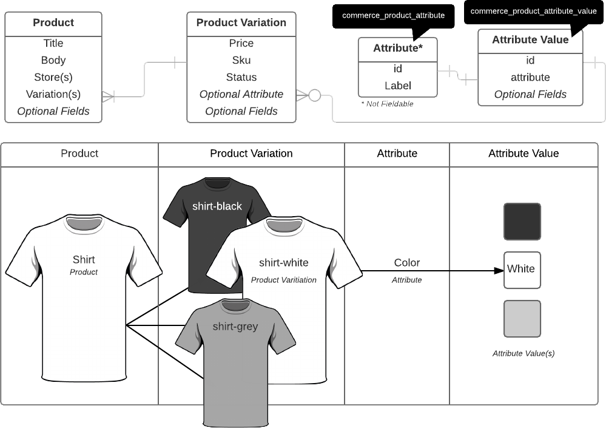

# Product Attributes

Products variations have attributes (color, size, etc) and each attribute has a optimized management mode that lets you 
add many fieldable attribute values at one time (all colors are entities, or all sizes are entities).

Product variations are not required to have attributes, but if they do, each attribute must have at least one attribute 
value. Product attributes (`commerce_product_attribute`) is actually a config entity and is not fieldable, but the
attribute values (`commerce_product_attribute_value`) are fieldable and can be rendered using display modes on the add
to cart form and other areas.

## Creating Attributes and their Values

The product attribute values user interface allows creating and re-ordering multiple values at the same time and a very
powerful translation capability:

... needs screenshot ...

Both attribute types and attribute values are fieldable entities. Any additional fields on the attribute type 
(e.g. image or price fields) will show up for editing beneath each value's Name field.

The next step was to create an API for managing attribute fields. Attribute fields are entity reference fields on
product variations which point to a specific attribute value assigned to the variation. Users can select attributes on
the product variation type form, automatically creating entity referenced fields as needed:

... needs screenshot  Adding product attributes to a product variation type. ...

## Editing Attributes

... needs description ...

... needs screenshot ...

## Optional Attributes

... needs description ... Optional attributes can be made by making them “not required”

... needs screenshot ...

## Products that don't have Attributes

But what happens if a variation type has no attributes? For example, a product is only selling a single file. In that
case, the Inline Entity Form widget will render the variation form as a regular fieldset on the product. 

... needs screenshot ...
