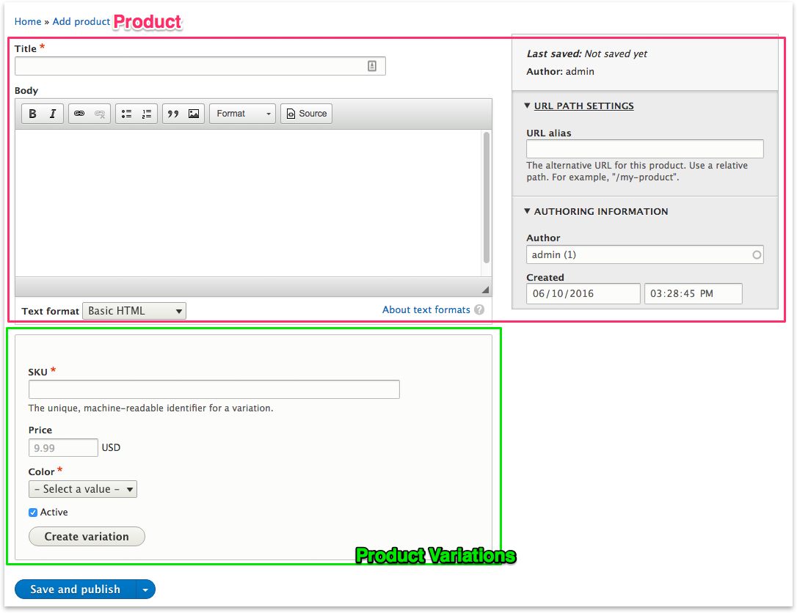
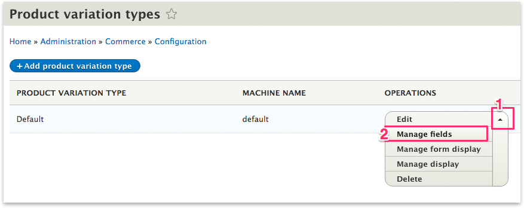
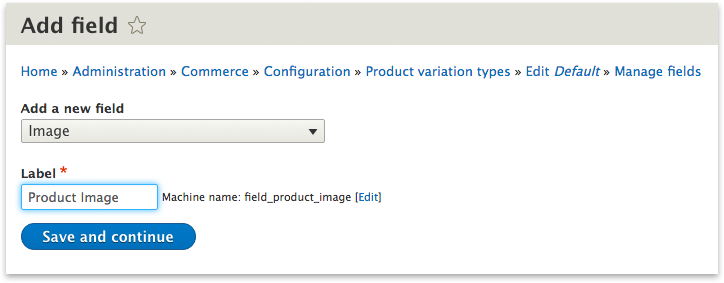
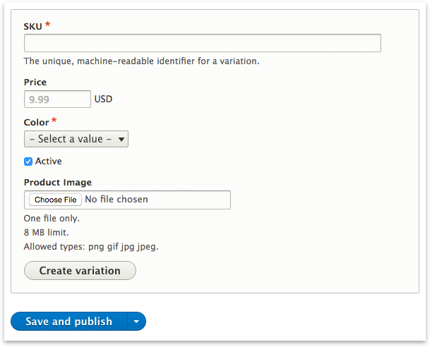
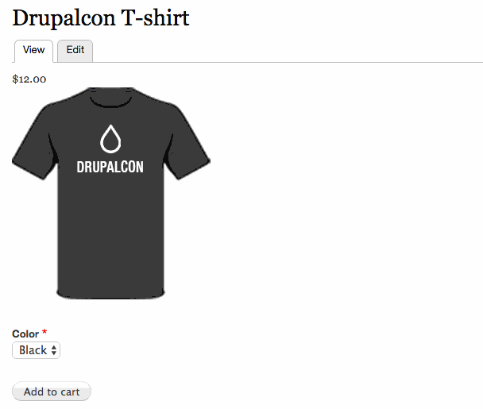
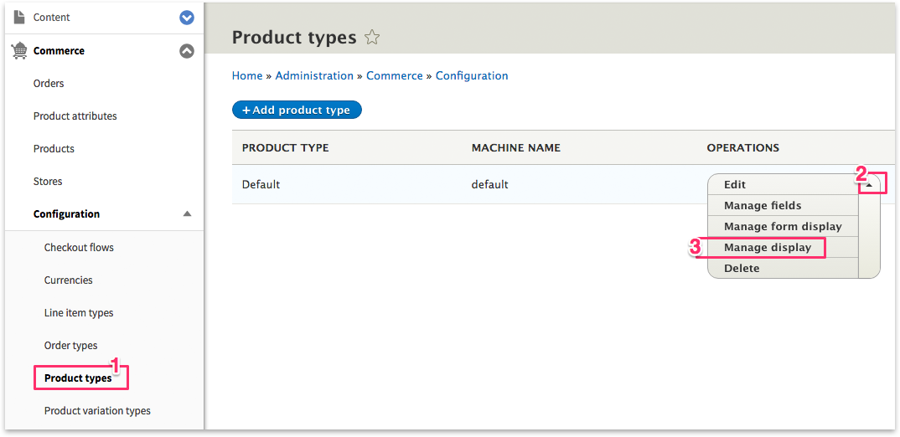

# Products and Product Variations

Imagine you sell t-shirts (Product Type) and you have new shipment of a particular Drupalcon t-shirt (Product). This
Drupalcon t-shirt comes in different sizes and colors. Each combination of size and color (Small Red, Large Blue)
represents a physical version of the t-shirt (Product Variation). If a product does not have attributes or unique
combinations of of attributes, you always need at least one variation per product.

> **NOTE**: In order to create your first product, you will need to have a store and a currency already set up. If you 
> don't have this, there's a [Getting Started](../getting-started.md) section that will walk you through the steps.

## Managing Products and their Variations

Variations are only manageable from the parent product, using Inline Entity Form. Variations do not have labels or 
titles. Labels, by default, are dynamically constructed from the attribute labels. To create or update a product
variation, you must go to the product screen and either choose an existing product or create a new one. 

You can simply go to `admin/commerce/products` and click "Add Product."

Once you have selected an existing product or added a new one, you will be presented with a form that looks similar to
the following. It will have "product details" like title, description, and path. And a widget for creating an unlimited
number of variations that have prices, skus, and any available attributes.

Deleting a product deletes its variations. Adding a variation to a product automatically creates a backreference on the
variation, accessed via $variation->getProduct().

## Product Fields

Products can have all kinds of fields. Often Commerce products will have a very media-rich set of content that is used
to describe and present the product. These fields will remain the same and be available no matter which product
variation is selected on the product page. Perhaps all of our t-shirt products have videos that show off Drupalers
sprinting while wearing each of the t-shirts. We will need a field that accepts video urls and can render them for the
page.

### Adding a Product Field

## Variation Fields

Products variations can have attributes and other kinds of fields. Going back to our t-shirt analogy from above, if our
t-shirts come in sizes and colors, perhaps the product variation should have an image field so you can upload a picture
of a small red shirt. These kinds of non-attribute fields are loaded dynamically when variations are chosen.

### Adding a Product Variation Field

Product variation types can be found at `admin/commerce/config/product-variation-types` and clicking on the arrow next
to the Edit button (1) will reveal all the management tasks for product variation types. Click on the `Manage Fields` 
option (2).

Once there, you can add as many types of fields as you like. Note that attributes that you have added in the past will 
show up here as entity reference fields. For our example, we will be adding an image field.

Choose the kind of field you would like to add and setup any of the settings as you need.

Finally, you should have your new field showing up in your product add form located at `product/add`

## Managing the display of the product

Once the product fields and the  variation fields are set up, the product page may not look as clean as the one
presented above. It's likely that there are a number of labels for fields (like price, product image, SKU, etc) that you
would rather not display. There are two different `Manage Display` locations you will need to manage in order to get the
desired output on your product page.

> **NOTE**: It's recommended that if you are using display modes to effect the product pages, that you use the "show
> weights" check box. The reason for this is that when a product is rendered, all fields, from the variation to the
> actual product get sorted based on weight. So if you just use the drag and drop methods, you will not get the granular
> control you might expect.

The first `Manage Display` page we will use to tweak the visual output of the product is the `Product Type` display
`admin/commerce/config/product-types` (this screen only controls product-level fields and the product selector (which 
is usually an add to cart button and an attribute selection)).

The second `Manage Display` page we will use 
